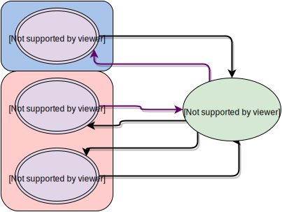

# Background and Motivations

Several different factors motivated dammit's development. The first of
these was the sea lamprey transcriptome project, which had annotation as
a primary goal. Many of dammit's core features were already implemented
there, and it seemed a shame not share that work with others in a usable
format. Related to this was a lack of workable and easy-to-use existing
solutions; in particular, most are meant to be used as protocols and
haven't been packaged in an automated format. Licensing was also a big
concern -- software used for science should be open source, easily
accessible, remixable, and free.

Implicit to these motivations is some idea of what a good annotator
*should* look like, in the author's opinion:

1.  It should be easy to install and upgrade
2.  It should only use Free software
3.  It should make use of standard databases
4.  It should output in reasonable formats
5.  It should be relatively fast
6.  It should try to be correct, insofar as any computational approach
    can be "correct"
7.  It should give the user some measure of confidence for its results.

## The Obligatory Flowchart

## Databases Used

-   Pfam-A
-   Rfam
-   OrthoDB
-   BUSCO databases
-   Uniref90
-   User-supplied protein databases

The last one is important, and sometimes ignored. To see more about these databases, 
see the [About Databases](database-about.md) section.
**Details below on mapping to user-supplied protein databases.**

## Software Used

For now, the software run is:

-   TransDecoder
-   BUSCO
-   HMMER
-   Infernal
-   LAST
-   shmlast (for crb-blast to user-supplied protein databases)
-   snakemake (under the hood)

All of these are Free Software, as in freedom and beer. 
**The specific set of software and databases used can be modified by specifying different [pipelines](pipelines.md).**

## Mapping to user databases using a Conditional Reciprocal Best BLAST Approach

Reciprocal Best Hit mapping (RBH) is a standard method for ortholog detection.
However, transcriptomes have multiple transcript isoforms, which confound RBH.

**Conditional Reciprocal Best Blast (CRBB)** attempts to associate those isoforms
with appropriate annotations by learning an appropriate e-value cutoff for 
different transcript lengths. The original implementation of CRBB 
can be found [here](https://github.com/cboursnell/crb-blast). 

*from
http://journals.plos.org/plosgenetics/article?id=10.1371/journal.pgen.1004365\#s5*

## shmlast: Conditional Reciprocal Best BLAST

shmlast is a reimplementation of the Conditional Reciprocal Best Hits 
algorithm for finding potential orthologs between a transcriptome and 
a species-specific protein database. It uses the LAST aligner and the 
pydata stack to achieve much better performance while staying in the 
Python ecosystem. 

For CRBL (shmlast), instead of fitting a linear model, we train a model.

-   SVM
-   Naive bayes

One limitation is that LAST has no equivalent to `tblastn`. So, we find
the RBHs using the TransDecoder ORFs, and then use the model on the
translated transcriptome versus database hits. 

`shmlast` is published in JOSS, doi:[10.21105/joss.00142](https://joss.theoj.org/papers/10.21105/joss.00142).
